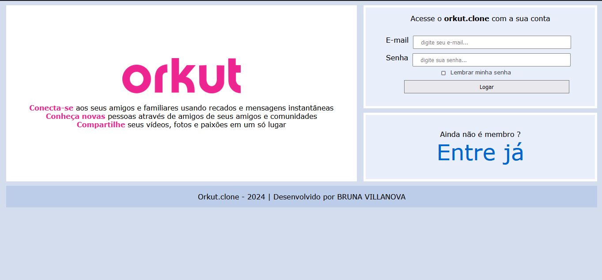

# Orkut Clone



Este projeto é uma recriação do layout do Orkut, utilizando HTML e CSS, com foco no uso do Flexbox. Foi desenvolvido por Bruna Villanova para treinar habilidades em CSS Flexbox.

## Índice

- [Visão Geral](#visão-geral)
- [Recursos](#recursos)
- [Estrutura do Projeto](#estrutura-do-projeto)
- [Instalação](#instalação)
- [Uso](#uso)
- [Contato](#contato)

## Visão Geral

O Orkut Clone é uma aplicação simples de front-end que recria a aparência e sensação do antigo site de rede social Orkut. Este projeto serve como um exercício de design responsivo e layout com CSS Flexbox.

## Recursos

- Estrutura de layout usando Flexbox
- Design responsivo
- Formulário de login simulado
- Links e botões estilizados

## Estrutura do Projeto

orkut/
├── img/
│ ├── icone.png
│ ├── image.png
│ └── orkut-logo.png 
├── style.css
└── index.htm


- `index.html`: Contém a estrutura HTML do projeto.
- `style.css`: Contém os estilos CSS, utilizando Flexbox para o layout.
- `img/`: Contém as imagens utilizadas no projeto.

## Instalação

Para visualizar e editar o projeto localmente, siga os passos abaixo:

1. Clone o repositório para o seu ambiente local:
   ```bash
   git clone https://github.com/seu-usuario/orkut-clone.git


2. Navegue até o diretório do projeto:

bash

    cd orkut-clone

Uso

    Abra o arquivo index.html no seu navegador preferido para visualizar o projeto.

    Edite os arquivos conforme necessário para personalizar o layout ou adicionar novas funcionalidades.

Contato

Desenvolvido por Bruna Villanova.

    Email: brunnavillanova@gmail.com
    LinkedIn: Bruna Villanova
    GitHub: Bruna Villanova

Se você tiver alguma dúvida ou sugestão, sinta-se à vontade para entrar em contato!


Nota: Este projeto é apenas para fins educacionais e de prática. Não está afiliado ou associado ao Orkut ou ao Google.